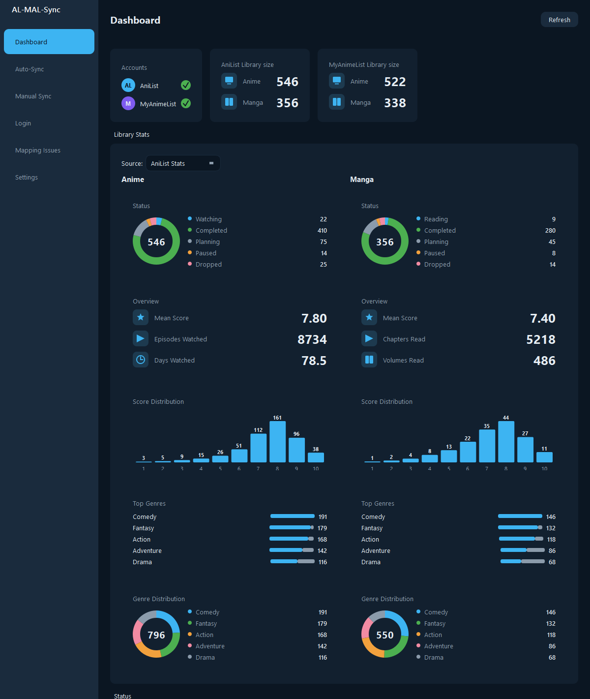

# AL-MAL-Sync


[](https://github.com/initcommit43/AL-MAL-Sync/releases/latest)

Keep [AniList](https://anilist.co) and [MyAnimeList](https://myanimelist.net)
in sync: a desktop app with a dashboard and one-click sync, a CLI for
automation, and an XML export/import path you can use as a standalone
backup of your AniList library.

Ported from [bigspawn/anilist-mal-sync](https://github.com/bigspawn/anilist-mal-sync)
(Go), which was studied as the reference for tricky sync logic (id-mapping
strategy order, score normalization, date-sync edge cases, favorites
asymmetry), not translated line-for-line.



## Features

- **One-click sync** between AniList and MyAnimeList, in either direction:
  anime and/or manga progress, status, score, and start/finish dates.
- **Dashboard** with library stats for each connected account: entry counts,
  a status breakdown donut, a score-distribution histogram, and a top-genres
  breakdown.
- **Library backup / export**: dump your AniList (or MyAnimeList) list to
  the same XML format MyAnimeList's own list export uses. Handy even if you
  never touch the sync side, since it's a portable backup you can re-import
  anywhere, including into AniList itself, which has no native export of
  its own.
- Matches entries across services through a chain of id-mapping strategies,
  from manual overrides and direct ids to the
  [anime-offline-database](https://github.com/manami-project/anime-offline-database),
  [Hato](https://hato.malupdaterosx.moe), [ARM](https://arm.haglund.dev), title
  matching, [Jikan](https://jikan.moe), and a last-resort live API search, so
  most entries match automatically without manual mapping.
- Favorites sync. This one only really goes MAL to AniList, since MyAnimeList's
  API has no endpoint to write favorites at all. AniList to MAL favorites just
  get reported as mismatched instead, since there's nothing to write.
- Tracks entries that couldn't be matched and lets you resolve them
  interactively instead of silently dropping them.
- One-shot sync, or a scheduled `watch` mode on an interval or cron schedule
  (CLI/Docker, for unattended background runs).
- Per-run statistics table plus a report of warnings, duplicate-match
  conflicts, and favorites mismatches.

## Installation

**Windows desktop app**: download `AL-MAL-Sync-windows.zip` from the
[latest release](https://github.com/initcommit43/AL-MAL-Sync/releases/latest),
extract it anywhere, and run `AL-MAL-Sync.exe` inside the extracted folder.
No Python install required.

**CLI, or another OS**: not yet published to PyPI, install from source:

```sh
git clone https://github.com/initcommit43/AL-MAL-Sync.git
cd AL-MAL-Sync
pip install -e ".[gui]"    # add [gui] to get the desktop app; omit for CLI-only
```

Or run it in Docker, see [Docker](#docker) below.

## Getting started

You'll need an [AniList API client](https://anilist.co/settings/developer)
and a [MyAnimeList API client](https://myanimelist.net/apiconfig). Each gives
you a client id (and secret, for AniList).

```sh
cp config.example.yaml config.yaml
# edit config.yaml with your AniList/MyAnimeList app credentials
```

Settings load with priority: environment variable > `config.yaml` > built-in
default, so credentials can come from either place (see
`config.example.yaml` for the full list of keys and their env var
equivalents). That's useful for keeping credentials in env vars in a
container while everything else lives in `config.yaml`.

### Desktop app

```sh
al-mal-sync-gui
```

- **Dashboard**: library stats per connected account (status breakdown,
  score distribution, top genres) plus current auth status.
- **Auto-Sync**: one-click sync with a progress bar and live log, an
  "Advanced options" section for direction/dry-run/matching sources, and the
  same interval/cron settings the CLI's `watch` mode uses.
- **Manual Sync**: export a list to MAL-format XML (backup, or moving to a
  service that doesn't support one direction) and import one back in.
- **Login**: connect/disconnect each service.
- **Mapping Issues**: resolve entries that couldn't be auto-matched, and
  edit manual id overrides, in a table instead of a terminal prompt.
- **Settings**: edit `config.yaml` from a form, including watch scheduling
  and an About section.

It shares the same `config.yaml`/`mappings.yaml`/token store as the CLI, so
either one works against the same setup. For unattended background
scheduling, use the CLI's `watch` command or Docker instead of leaving the
GUI open, since its scheduling only runs while the window is open.

#### Desktop launcher

For a normal double-click launch instead of `al-mal-sync-gui` from a
terminal, build a standalone bundle once:

```sh
pip install pyinstaller
pyinstaller --onedir --noconsole --name "AL-MAL-Sync" --distpath dist --workpath build/gui --specpath build/gui --paths src scripts/gui_entry.py
```

This drops a self-contained `dist/AL-MAL-Sync/` folder (`AL-MAL-Sync.exe`
plus an `_internal/` directory) that runs on its own -- no `.venv` or
source checkout needs to sit next to it, so the whole folder can be zipped
up and shared. It's a build artifact (gitignored, not tracked), so rebuild
it after pulling changes.

### CLI

```sh
al-mal-sync login              # authenticate with both services (opens a browser)
al-mal-sync status              # check auth status
al-mal-sync sync                # one-shot sync, anime, AniList -> MyAnimeList
al-mal-sync sync --all --dry-run --favorites   # anime + manga, preview only, plus favorites
al-mal-sync watch -i 6h         # sync every 6 hours
al-mal-sync watch -s "0 */6 * * *"  # or on a cron schedule instead
al-mal-sync unmapped --fix      # resolve entries that couldn't be auto-matched
al-mal-sync export -s anilist --all            # AniList's list -> MAL-format XML files
al-mal-sync import -i list.xml -t anilist      # import a MAL-format XML file into AniList
```

Key `sync`/`watch` flags: `--manga` (manga instead of anime), `--all` (both),
`--reverse-direction` (MyAnimeList -> AniList instead of the default),
`--force` (skip matching, sync by id directly), `--dry-run`, `--offline-db`/
`--arm-api`/`--jikan-api` (opt in to extra id-mapping sources), `--favorites`.
Run `al-mal-sync <command> --help` for the full list.

`export`/`import` read and write the same XML format myanimelist.net's own
"Export list" produces (and its importer, and AniList's list importer, both
accept): the backup path described above, from a terminal. `import` reuses
the exact same id-mapping/matching pipeline as `sync`, so a file with no
AniList ids in it (e.g. one exported straight from MAL) still matches
existing entries by title/offline-db/Hato/ARM/Jikan, same as a live
MyAnimeList -> AniList sync would.

A couple of date-sync safety rules worth knowing: a missing date on one side
never wipes out a real date already set on the other side, dates only compare
by day (no time-of-day mismatches), and a finish date is only ever pushed
across once an entry is actually marked completed.

## Docker

```sh
cp docker-compose.example.yaml docker-compose.yaml
# edit the credentials/env vars in docker-compose.yaml
docker compose run --rm al-mal-sync al-mal-sync login   # one-time auth
docker compose up -d                                     # then run watch mode
```

The container persists `token.json`/`mappings.yaml`/caches under
`/config/al-mal-sync` (bind-mount `/config`, as the example compose file
does, to keep them across restarts). It honors `PUID`/`PGID` so files written
there are owned by your host user, not a container-only uid.

## Development

```sh
pip install -e ".[dev]"
ruff check .
pytest
```

GUI tests (`tests/test_gui_*.py`) skip themselves gracefully if PySide6
isn't installed; run `pip install -e ".[dev,gui]"` instead to include them.

## Credits

- [bigspawn/anilist-mal-sync](https://github.com/bigspawn/anilist-mal-sync):
  the Go reference this project's sync logic is ported from.
- [manami-project/anime-offline-database](https://github.com/manami-project/anime-offline-database),
  [Hato](https://hato.malupdaterosx.moe), [Jikan](https://jikan.moe), and
  [ARM](https://arm.haglund.dev): the id-mapping data sources that make
  automatic AniList<->MAL matching possible.

## License

[MIT](LICENSE)
